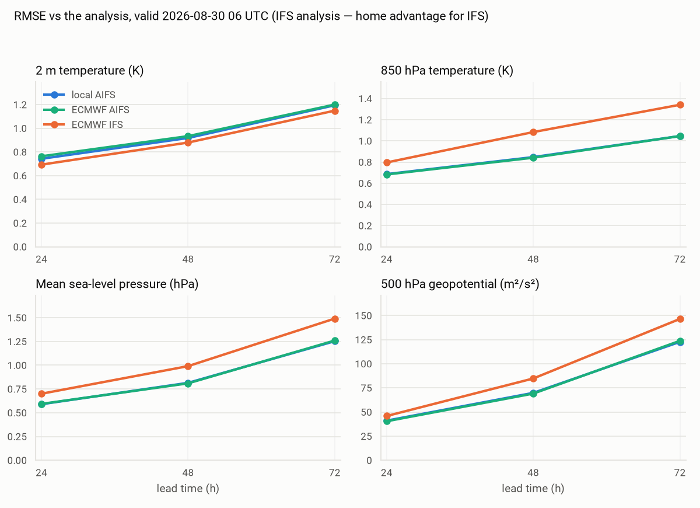
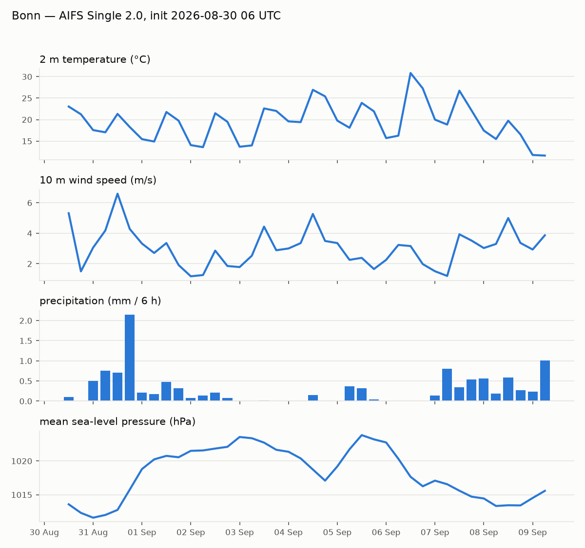
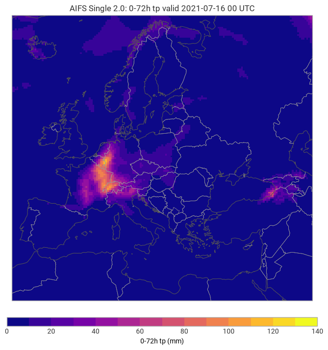

# aifs-local


Run ECMWF's AIFS Single 2.0 machine-learning weather model on a consumer
GPU, end to end: initial conditions from ECMWF open data, forecast with
anemoi-inference, plots with earthkit.

The point is not the forecast — those can be downloaded ready-made. The
point is understanding the model and the data underneath it, and feeding
what breaks back upstream: NOTES.md explains the weather data model for
people coming from other corners of machine learning, FRICTION.md logs
every place where documentation and reality disagreed.


## Usage

One command from date to forecast (first run downloads the ~1 GB
checkpoint from Hugging Face):

```sh
python run_forecast.py --date latest --lead-time 24
```

Or step by step:

```sh
python initial_conditions.py --date 2026-08-30T06
python run_forecast.py --lead-time 12
python plot_forecast.py --param 2t --domain Europe
```

Forecast states are written to `outputs/` as compressed .npz (values,
latitudes, longitudes per 6 h step). Useful flags on `run_forecast.py`:
`--device cpu`, `--attention sdpa` (runs without flash-attn),
`--precision 16`, `--num-chunks N` for tighter memory.

On an RTX 3060 (12 GB) a 6 h step takes ~13 s at ~6 GB peak GPU memory.

## Toolbox

| script | purpose |
|---|---|
| `initial_conditions.py` | download and prepare an input state from open data |
| `run_forecast.py` | run the model (`--raw-dir` also writes replayable states) |
| `plot_forecast.py` | map any field (`--sum-run` for accumulated precipitation) |
| `verify_forecast.py` | score one forecast against the analysis |
| `plot_error_growth.py` | RMSE vs lead time across initialisations |
| `compare_models.py` | local AIFS vs operational IFS and AIFS |
| `meteogram.py` | one location's forecast as time-series panels |
| `animate_forecast.py` | a whole run as a GIF |
| `lagged_ensemble.py` | ensemble statistics from successive runs |
| `daily_verification.py` | scheduler-friendly daily run + scoring into scores.csv |
| `era5_conditions.py` | initial conditions from ERA5 (CDS) for any date back to 1940 |
| `states.py` | finding forecast states by run or by valid time |
| `plotstyle.py` | shared figure styling |

## Verification

`verify_forecast.py` scores one forecast against the analysis at its
valid time (open data, step 0 of that cycle; bias, MAE, RMSE);
`plot_error_growth.py` does it across initialisations. Hindcasts
initialised 1–3 days before 2026-08-30 06 UTC, verified globally on
N320 (RMSE):

| lead | 2t (K) | t_850 (K) | msl (hPa) | z_500 (m²/s²) |
|---|---|---|---|---|
| +24 h | 0.74 | 0.69 | 0.59 | 41 |
| +48 h | 0.92 | 0.85 | 0.81 | 70 |
| +72 h | 1.19 | 1.05 | 1.25 | 123 |


**One case, not a skill assessment.** Three forecasts verified at a
single valid time show the shape of error growth; averaged skill needs
weeks of samples, which is what `daily_verification.py` accumulates in
`scores.csv`. Two further caveats: forecast and analysis travel the same
0.25° → N320 regridding path, so that error partly cancels and the
numbers come out slightly optimistic; and +96 h was out of reach because
open data retains only about four days (see FRICTION.md).

## AIFS vs. IFS

`compare_models.py` scores the local runs against ECMWF's operational
IFS (the physics model) and operational AIFS, all against the same
analysis:



The result worth having is the first one: the local AIFS line hides
almost perfectly under ECMWF's operational AIFS. Reproducing the
official product from open-data initial conditions is what validates
this pipeline, and it holds regardless of sample size.

In this one case AIFS also comes out ahead of IFS on t850, msl and z500,
while IFS keeps 2 m temperature. That is an observation, not a finding:
one valid time cannot rank two forecasting systems, and the verifying
analysis is IFS's own product. ECMWF's published scorecards are the
place to look for the real comparison.

## Ten days of weather

`animate_forecast.py` renders a whole run as a GIF — here 2 m
temperature, initialised 2026-08-30 06 UTC, one frame per 12 h:


## Point forecast

`meteogram.py` extracts the nearest grid point and draws the classic
meteogram panels (default location: Bonn):



## Replay plugin

[plugin/](plugin/) contains `anemoi-inference-input-raw-plugin`, an
input plugin that reads the .npz states written by anemoi-inference's
built-in `raw` output (or by `run_forecast.py --raw-dir`), so forecasts
can be replayed or continued without re-fetching source data:

```sh
pip install -e plugin
python run_forecast.py --lead-time 12 --raw-dir data/raw
anemoi-inference run configs/replay-from-raw.yaml date=2026-08-30T12:00:00
```

`configs/replay-to-grib.yaml` is the same replay writing standard GRIB
(reduced Gaussian grid preserved, `class: ai` encoding as in the model
card), so the output opens in any meteorology tool.

## Standing verification

`daily_verification.py` is built for a scheduler: it runs the latest
cycle's 24 h forecast and appends scores for every matured forecast to
`scores.csv` (in the model's own units, so msl is in Pa there). Re-runs
skip rows that already exist. A few weeks of rows turn the single-case
numbers above into averaged skill estimates.

```sh
# crontab -e — daily at 16:00 local time
0 16 * * * cd /path/to/aifs-local && .venv/bin/python daily_verification.py >> daily.log 2>&1
```

On Windows with WSL, point a Task Scheduler entry at a one-line `.cmd`
that calls `wsl -d Ubuntu-24.04 -e bash -lc "<the command above>"`.

## Case studies from ERA5

Open data only reaches back four days; `era5_conditions.py` fetches
initial conditions from ERA5 via the CDS API instead — any date back to
1940. Requires a free CDS account, an accepted ERA5 licence and
`pip install cdsapi`; then:

```sh
python era5_conditions.py --date 2021-07-13T00
python run_forecast.py --state data/state_20210713T00.npz --lead-time 72
python plot_forecast.py --file outputs/forecast_20210716T00_+072h.npz --param tp --sum-run
```

That date is the day before the July 2021 Ahr valley flood:



Verified against ERA5's own precipitation for the event's 24 hours
(box 49.5–51.5°N, 5–8.5°E; ERA5 truth: box max 100.5 mm, Ahrweiler
grid point 68.7 mm):

| init | lead to event | box max | Ahrweiler point |
|---|---|---|---|
| 14 Jul 00 UTC | 6–30 h | 90.8 mm | 53.9 mm |
| 13 Jul 00 UTC | 30–54 h | 67.2 mm | 56.4 mm |

Synoptic skill is unimpaired: +24 h z500 RMSE vs the ERA5 analysis is
37 m²/s², the same band as the operational-window runs. Caveats that
belong to these numbers: ERA5 has no wave-period-band fields, so
`era5_conditions.py` zeroes those six inputs (measured cost on +24 h
2t: 0.13 K rms; wave outputs untrustworthy for the first day or two),
grid-scale values are not point observations (the real event exceeded
150 mm locally), and verifying an ERA5-initialised forecast against
ERA5 shares the analysis's own view of the event.

See NOTES.md for how the pieces fit together and FRICTION.md for the
sharp edges hit along the way.

## Requirements

- Linux x86_64 (developed under WSL2 / Ubuntu 24.04), Python 3.12
- NVIDIA GPU, Ampere or newer, or CPU fallback
- ~5 GB disk for the environment, ~2 GB for checkpoint and data

## Setup

```sh
python3.12 -m venv .venv
. .venv/bin/activate
pip install -r requirements.txt
pip install --no-deps "flash-attn @ https://github.com/cathalobrien/get-flash-attn/releases/download/v0.1-alpha/flash_attn-2.8.3+cu12torch2.7cxx11abiFALSE-cp312-cp312-linux_x86_64.whl"
```

The flash-attn wheel is the prebuilt one referenced by the
[aifs-single-2.0](https://huggingface.co/ecmwf/aifs-single-2.0) model repo;
it avoids compiling from source. Without a CUDA GPU, skip it — the runner
can fall back to PyTorch's built-in attention (see NOTES.md).

## Data attribution

Initial conditions come from [ECMWF open data](https://www.ecmwf.int/en/forecasts/datasets/open-data)
(CC BY 4.0). The model checkpoint is © ECMWF, also CC BY 4.0.

## License

MIT — see [LICENSE](LICENSE). This is an independent project, not
affiliated with or endorsed by ECMWF.
