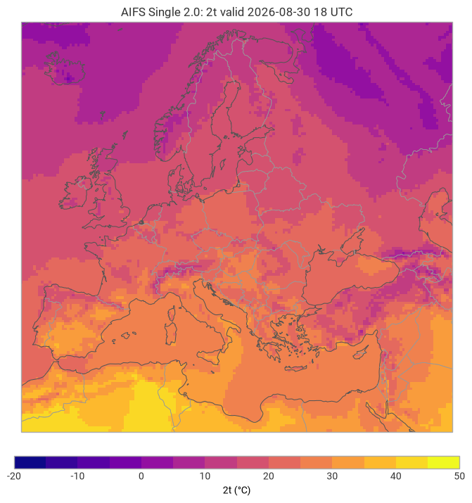
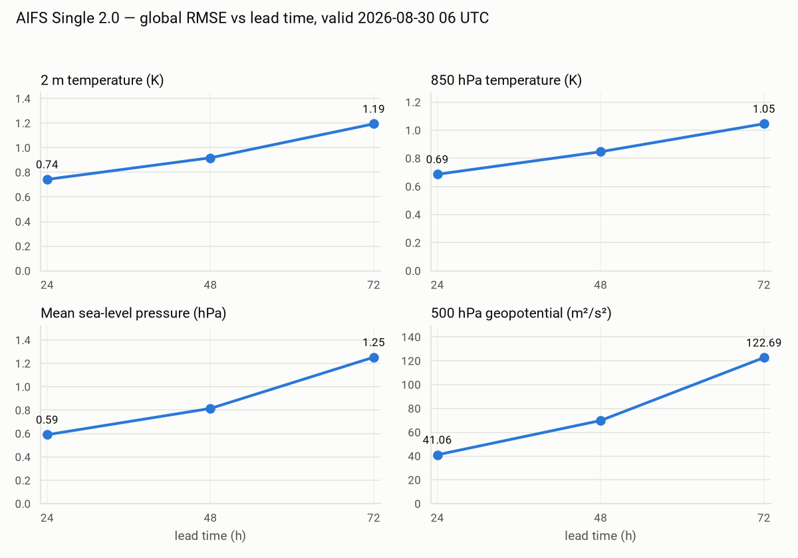
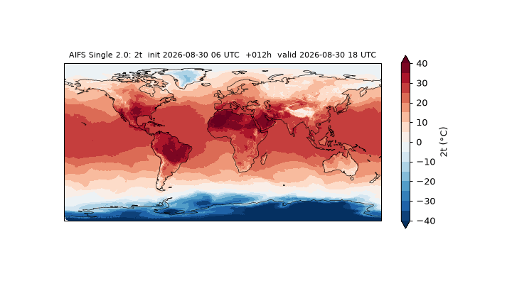

# aifs-local


Run ECMWF's AIFS Single 2.0 machine-learning weather model on a consumer
GPU, end to end: initial conditions from ECMWF open data, forecast with
anemoi-inference, plots with earthkit.



## Usage

One command from date to forecast (first run downloads the ~1 GB
checkpoint from Hugging Face):

```sh
python run_forecast.py --date latest --lead-time 24
```

Or step by step:

```sh
python initial_conditions.py --date 2026-08-30T06
python run_forecast.py --lead-time 12
python plot_forecast.py --param 2t --domain Europe
```

Forecast states are written to `outputs/` as compressed .npz (values,
latitudes, longitudes per 6 h step). Useful flags on `run_forecast.py`:
`--device cpu`, `--attention sdpa` (runs without flash-attn),
`--precision 16`, `--num-chunks N` for tighter memory.

On an RTX 3060 (12 GB) a 6 h step takes ~13 s at ~6 GB peak GPU memory.

## Verification

`verify_forecast.py` scores one forecast against the analysis at its
valid time (open data, step 0 of that cycle; bias, MAE, RMSE);
`plot_error_growth.py` does it across initialisations. Hindcasts
initialised 1–3 days before 2026-08-30 06 UTC, verified globally on
N320 (RMSE):

| lead | 2t (K) | t_850 (K) | msl (hPa) | z_500 (m²/s²) |
|---|---|---|---|---|
| +24 h | 0.74 | 0.69 | 0.59 | 41 |
| +48 h | 0.92 | 0.85 | 0.81 | 70 |
| +72 h | 1.19 | 1.05 | 1.25 | 123 |



Rollout error compounding, measured. Scores are slightly flattered by
the shared initialisation and the double regridding; the shape is the
point. +96 h was out of reach: open data retains only about four days
(see FRICTION.md).

## Ten days of weather

`animate_forecast.py` renders a whole run as a GIF — here 2 m
temperature, initialised 2026-08-30 06 UTC, one frame per 12 h:



## Replay plugin

[plugin/](plugin/) contains `anemoi-inference-input-raw-plugin`, an
input plugin that reads the .npz states written by anemoi-inference's
built-in `raw` output (or by `run_forecast.py --raw-dir`), so forecasts
can be replayed or continued without re-fetching source data:

```sh
pip install -e plugin
python run_forecast.py --lead-time 12 --raw-dir data/raw
anemoi-inference run configs/replay-from-raw.yaml date=2026-08-30T12:00:00
```

See NOTES.md for how the pieces fit together and FRICTION.md for the
sharp edges hit along the way.

## Requirements

- Linux x86_64 (developed under WSL2 / Ubuntu 24.04), Python 3.12
- NVIDIA GPU, Ampere or newer, or CPU fallback
- ~5 GB disk for the environment, ~2 GB for checkpoint and data

## Setup

```sh
python3.12 -m venv .venv
. .venv/bin/activate
pip install -r requirements.txt
pip install --no-deps "flash-attn @ https://github.com/cathalobrien/get-flash-attn/releases/download/v0.1-alpha/flash_attn-2.8.3+cu12torch2.7cxx11abiFALSE-cp312-cp312-linux_x86_64.whl"
```

The flash-attn wheel is the prebuilt one referenced by the
[aifs-single-2.0](https://huggingface.co/ecmwf/aifs-single-2.0) model repo;
it avoids compiling from source. Without a CUDA GPU, skip it — the runner
can fall back to PyTorch's built-in attention (see NOTES.md).

## Data attribution

Initial conditions come from [ECMWF open data](https://www.ecmwf.int/en/forecasts/datasets/open-data)
(CC BY 4.0). The model checkpoint is © ECMWF, also CC BY 4.0.

## License

MIT — see [LICENSE](LICENSE). This is an independent project, not
affiliated with or endorsed by ECMWF.
